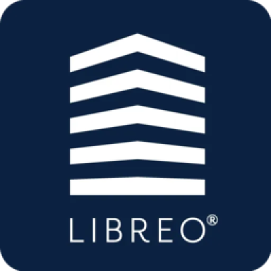

# ioBroker.libreo

**Tests:** 

## libreo adapter for ioBroker

Get informations for libreo wallboxes

## Changelog
<!--
	Placeholder for the next version (at the beginning of the line):
	### **WORK IN PROGRESS**
-->
### 1.4.6 (2025-03-21)
* (spabas) Explites Löschen der Sesstion-States bei Session Ende

### 1.4.5 (2025-03-16)
* (spabas) Lib update

### 1.4.4 (2025-03-15)
* (spabas) Lib update

### 1.4.3 (2025-03-09)
* (spabas) Session-Ende durch Unplugging => Status "Available"

### 1.4.2 (2025-03-09)
* (spabas) Session-Ende durch Unplugging => Status "Available"

### 1.4.1 (2025-03-09)
* (spabas) Session-Ende auch bei Status 277 (beendet, aber noch angesteckt ?), damit Löschen der aktiven Session

### 1.4.0 (2025-03-09)
* (spabas) new metrics data (current, power and voltage)

### 1.3.3 (2024-11-16)
* (spabas) session end now only by receiving status 267, not anymore if no currentSessionState is received

### 1.3.2 (2024-08-10)
* (spabas) logo update

### 1.3.1 (2024-07-27)
* (spabas) don't clear current session if recieving charging state without currentSessionState

### 1.3.0 (2024-07-07)
* (spabas) get consumed energy in current session

### 1.2.0 (2024-06-22)
* (spabas) load initial loading sessions from begin of current year

### 1.1.2 (2024-06-20)
* (spabas) last-updated property and small improvements

### 1.1.1 (2024-06-20)
* (spabas) get orgs periodicly and open new web socket every 10 minutes

### 1.1.0 (2024-06-20)
* (spabas) load users
* (spabas) set charging (impersenation user)

### 1.0.0 (2024-06-16)
* (spabas) initial release

## License
MIT License

Copyright (c) 2025 spabas <bastian.spaeth@gmx.de>

Permission is hereby granted, free of charge, to any person obtaining a copy
of this software and associated documentation files (the "Software"), to deal
in the Software without restriction, including without limitation the rights
to use, copy, modify, merge, publish, distribute, sublicense, and/or sell
copies of the Software, and to permit persons to whom the Software is
furnished to do so, subject to the following conditions:

The above copyright notice and this permission notice shall be included in all
copies or substantial portions of the Software.

THE SOFTWARE IS PROVIDED "AS IS", WITHOUT WARRANTY OF ANY KIND, EXPRESS OR
IMPLIED, INCLUDING BUT NOT LIMITED TO THE WARRANTIES OF MERCHANTABILITY,
FITNESS FOR A PARTICULAR PURPOSE AND NONINFRINGEMENT. IN NO EVENT SHALL THE
AUTHORS OR COPYRIGHT HOLDERS BE LIABLE FOR ANY CLAIM, DAMAGES OR OTHER
LIABILITY, WHETHER IN AN ACTION OF CONTRACT, TORT OR OTHERWISE, ARISING FROM,
OUT OF OR IN CONNECTION WITH THE SOFTWARE OR THE USE OR OTHER DEALINGS IN THE
SOFTWARE.